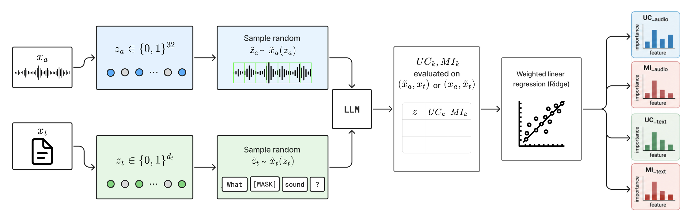

# Investigating Necessity and Sufficiency of Multimodal Interaction in Music-QA LLMs via audioDIME

<!-- TODO: arXiv badge once available, e.g.
[](https://arxiv.org/abs/XXXX.XXXXX)
-->
arXiv still not available!

*Flavio Ingenito, Luca Comanducci, Francesca Ronchini, Paolo Bestagini*

<p align="center">
  
</p>

This repository contains the code for *[Investigating Necessity and Sufficiency of
Multimodal Interaction in Music-QA LLMs via audioDIME]()*, submitted to ICASSP 2027.

In this paper, we investigate how Large Audio Language Models (LALM) combine input modalities, audio and text, to generate a response. To do this, we propose audioDIME, an adaptation of the [DIME](https://arxiv.org/pdf/2203.02013) framework to the audio-musical domain, to disentangle unimodal contributions from multimodal interactions in [Qwen2.5-Omni-7B](https://arxiv.org/pdf/2503.20215) and [AudioFlamingo3](https://arxiv.org/pdf/2507.08128) on [HumMusQA](https://arxiv.org/pdf/2603.27877), and evaluate their necessity and sufficiency through masking.

Supplementary material is available [here](https://fingenito.github.io/investigating-nec-suf-audioDIME-icassp2027/).

## Method

For each sample, the model first generates its answer greedily, one token at a time. audioDIME explains the pre-softmax logit assigned to each generated token, disentangling an audio-only contribution (`UC_audio`), a text-only contribution (`UC_text`), and a term capturing audio--text interaction (`MI`). Input features are perturbed and the resulting logits are re-scored via teacher forcing, so the analysis measures the effect of the input on each fixed generated token rather than on a newly generated one.

Feature importance within each component is estimated with a LIME-style weighted Ridge surrogate. Audio is split into four source stems via Demucs and each stem is further divided into onset-detected temporal segments, yielding 32 audio features; text features are the individual words of the question. Audio and text are perturbed in separate runs while the other modality remains unchanged: masked audio components are omitted and the result is peak-renormalized, whereas masked words are replaced with a placeholder token. The surrogate then provides local importance scores for each feature and component.

We then test whether the top-ranked features from each ranking (`UC_audio`, `UC_text`, `MI`) affect the model’s original answer using two masking-based, chance-normalized metrics: *sufficiency* (whether keeping only the top-*k* features preserves confidence in the original answer) and *necessity* (whether removing them reduces that confidence). Both metrics range from 0 to 1; 0.5 indicates that at least half of the model’s confidence advantage over chance is preserved or removed, respectively.

## Repository structure

The repository is organised as follows:
* `QA_analysis/utils` — the core audioDIME implementation: audio segmentation, masking, LIME surrogate fitting, and the GPU runners used to query the models.
* `QA_analysis/experiments` — base scripts shared across experiments: running the masking-based perturbations used to compute necessity and sufficiency (Exp E).
* `QA_analysis/paper` — experiments run on Qwen2.5-Omni, one subfolder per condition (complete, audio-only, text-only).
* `QA_analysis/paper_af3` — the same three experiments run on Audio Flamingo 3.

## Setup

To get started, please prepare the code and python environment.

1. Clone this repository:
    ```bash
    git clone https://github.com/fingenito/investigating-nec-suf-audioDIME-icassp2027
    cd ./investigating-nec-suf-audioDIME-icassp2027
    ```

2. Install the required dependencies by running the following commands:
    ```bash
    # (Optional) Create a conda virtual environment
    conda create -n env-audiodime python=3.11
    conda activate env-audiodime

    # Install PyTorch first, choosing the appropriate CUDA version
    pip install torch==2.6.0 torchaudio==2.6.0 torchvision==0.21.0 \
        --index-url https://download.pytorch.org/whl/cu124

    # Install the rest of the dependencies
    pip install -r requirements.txt
    ```

    Note: Qwen2.5-Omni and Audio Flamingo 3 require different `transformers` versions — see the comments in `requirements.txt` for details.

## Dataset

We use [HumMusQA](https://arxiv.org/pdf/2603.27877), a benchmark of 320 expert-written, multiple-choice music questions (4 options each) paired with Creative-Commons-licensed audio from Jamendo. Questions were authored and validated by music theory experts specifically to require genuine listening, rather than being auto-generated from captions/tags, a known failure mode of prior music-QA datasets, which are often solvable by text-only models exploiting language priors alone. This makes HumMusQA particularly well-suited to our study: probing whether models actually need the audio, or can shortcut through text, is precisely the question our necessity/sufficiency analysis addresses.

You can download the dataset from [HuggingFace](https://huggingface.co/datasets/mtg-upf/HumMusQA).

## Running the experiments

> Before running anything, edit the hardcoded paths at the top of each script (`EXPERIMENT_RESULTS_ROOT`, model path, dataset root) to match your own environment.

Each experiment has two stages: **Exp A** builds the audioDIME feature ranking, **Exp E** consumes it to compute necessity/sufficiency curves. Every combination of model (Qwen2.5-Omni, Audio Flamingo 3) and condition (complete, audio-only, text-only) has its own self-contained folder — `paper/Faithfulness_correct`, `paper/Faithfulness_audio_only`, `paper/Faithfulness_text_only` for Qwen, and the same three under `paper_af3/` for Audio Flamingo 3 — each with its own `batch_exp_a.py` and `batch_exp_e.py`. The commands below use the complete condition on Qwen as an example; the other five combinations follow the same pattern, just pointing at their own folder.

1. Run Exp A:
    ```bash
    python -m QA_analysis.paper.Faithfulness_correct.batch_exp_a
    ```
    This writes a new `batch_run_XX` folder under `Results_paper/experiments/exp_A/` (or `Results_paper_af3/...` for Audio Flamingo 3).

2. Run Exp E, pointing `--exp-a-dir` at the `batch_run_XX` folder produced above:
    ```bash
    python -m QA_analysis.paper.Faithfulness_correct.batch_exp_e \
        --exp-a-dir Results_paper/experiments/exp_A/batch_run_00
    ```
    This produces the necessity/sufficiency curves used to generate the paper's figures.

## Citation

<!-- TODO: bibtex, once the paper has a public entry (arXiv/ICASSP proceedings) -->
```bibtex

```

## License

<!-- TODO: not decided yet -->
