Accompanying website to the paper _Investigating Necessity and Sufficiency of Multimodal Interaction in Music-QA LLMs via audioDIME_, by _Flavio Ingenito, Luca Comanducci, Francesca Ronchini, Paolo Bestagini_, submitted to ICASSP 2027.

## Abstract

Audio LLMs have advanced music understanding, yet how they combine audio and text remains unclear, and %standard attribution cannot distinguish correlation from causal reliance
standard attribution methods do not test whether attributed features are necessary or sufficient under intervention. We adapt DIME to disentangle unimodal contributions from multimodal interactions in Qwen2.5-Omni-7B and AudioFlamingo3 on HumMusQA, and evaluate their necessity and sufficiency through masking. Across both models, audio’s unimodal contribution is often sufficient but rarely necessary, whereas interaction features have substantially higher necessity and, under complete input, approach text contributions. These results suggest that audio primarily influences predictions through its interaction with the question rather than as an independent decision signal.

## Additional Material

Due to space constraints, the paper reports sufficiency and necessity results only for the complete condition of both models. Here, we provide the extended results for all conditions, together with a worked example that verifies the audio segmentation. Specifically, we present:

- Sufficiency and necessity of `MI`, split by prediction correctness, for all six combinations of model (Qwen2.5-Omni and AudioFlamingo3) and condition (complete, audio-only, and text-only).
- The same breakdown for `UC_text`, `UC_audio`, and `MI` (modality diagnosis), considering correct predictions only, again for all six combinations.
- A worked example of onset-guided audio segmentation for one HumMusQA sample, showing that the resulting segments are meaningful and correctly localized in time.

Samples with <em>porig</em> &lt; 0.40 are excluded from every curve, as the normalization denominator would otherwise be too small and unstable. The table below reports, out of 320 samples, how many remain after this filter for each model and condition, split according to whether the model's original prediction was correct. This makes the effective sample size behind each curve explicit.

<table align="center">
  <thead>
    <tr>
      <th align="left">Model</th>
      <th align="left">Condition</th>
      <th align="right">Remaining</th>
      <th align="right">Correct</th>
      <th align="right">Incorrect</th>
    </tr>
  </thead>
  <tbody>
    <tr><td>Qwen2.5-Omni</td><td>Complete</td><td align="right">300</td><td align="right">192</td><td align="right">108</td></tr>
    <tr><td>Qwen2.5-Omni</td><td>Audio-only</td><td align="right">270</td><td align="right">120</td><td align="right">150</td></tr>
    <tr><td>Qwen2.5-Omni</td><td>Text-only</td><td align="right">283</td><td align="right">100</td><td align="right">183</td></tr>
    <tr><td>AudioFlamingo3</td><td>Complete</td><td align="right">300</td><td align="right">204</td><td align="right">96</td></tr>
    <tr><td>AudioFlamingo3</td><td>Audio-only</td><td align="right">283</td><td align="right">175</td><td align="right">108</td></tr>
    <tr><td>AudioFlamingo3</td><td>Text-only</td><td align="right">290</td><td align="right">167</td><td align="right">123</td></tr>
  </tbody>
</table>

### Sufficiency & Necessity of MI

For each sample, sufficiency measures whether the top-ranked `MI` (multimodal interaction) features alone preserve the model's confidence in its original answer, whereas necessity measures whether removing them reduces that confidence. Both metrics are normalized against chance level. Results are reported separately for samples whose original prediction was correct or incorrect.

<h4 align="center">Complete Condition</h4>

  

    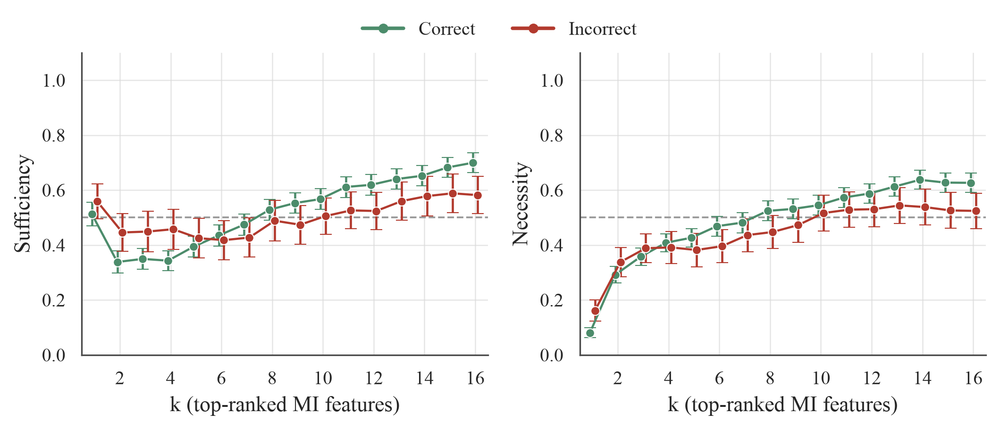
     
    <em>Qwen2.5-Omni</em>
  

  

    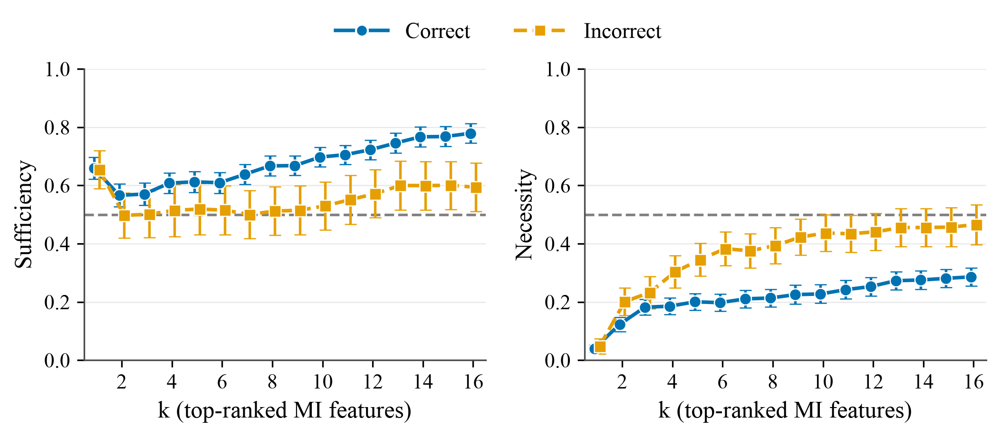
     
    <em>AudioFlamingo3</em>
  

<h4 align="center">Text_only condition</h4>

  

    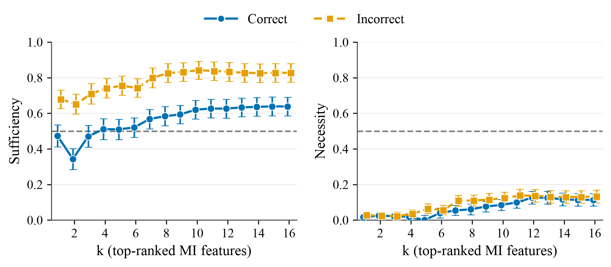
     
    <em>Qwen2.5-Omni</em>
  

  

    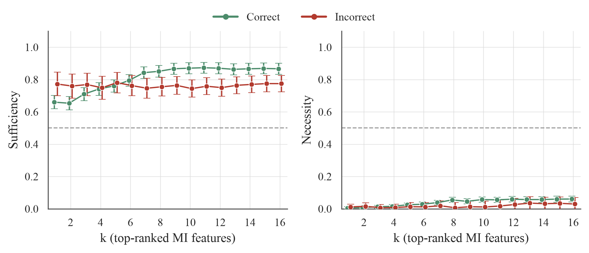
     
    <em>AudioFlamingo3</em>
  

<h4 align="center">Audio_only condition</h4>

  

    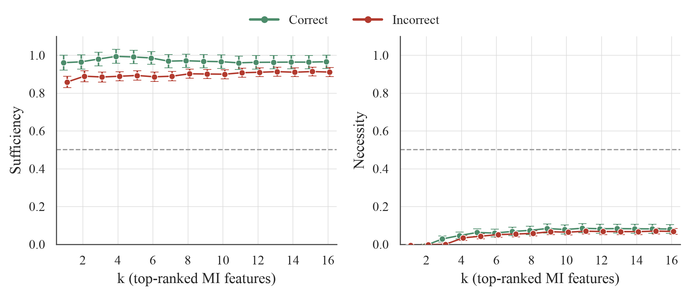
     
    <em>Qwen2.5-Omni</em>
  

  

    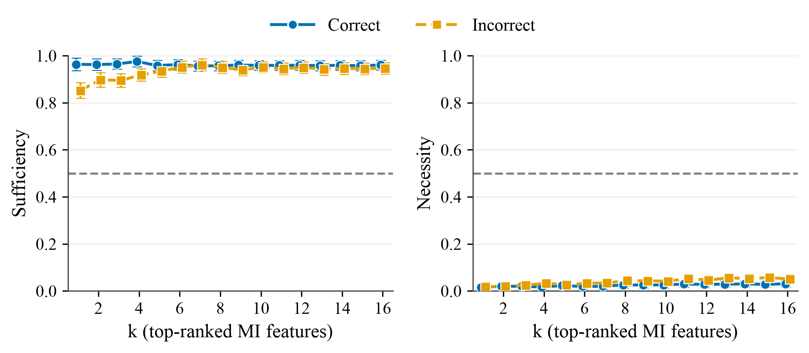
     
    <em>AudioFlamingo3</em>
  

###  Modality Contributions

For samples where the model's original prediction was correct, we compare sufficiency and necessity across the three feature sources: `UC_text`, `UC_audio`, and `MI`.

- Complete condition

  

    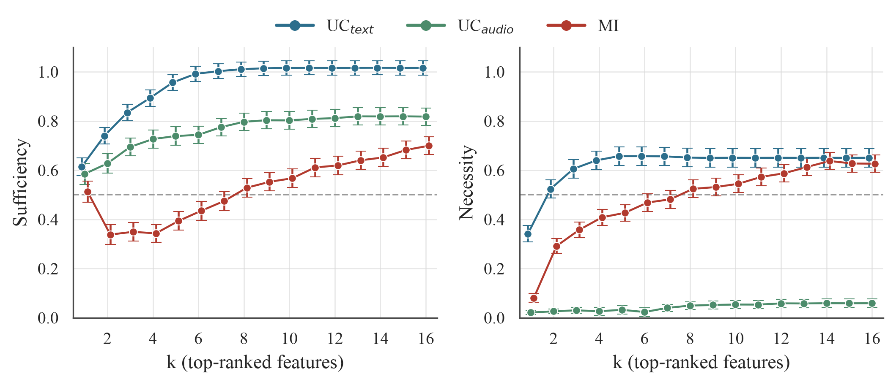
     
    <em>Qwen2.5-Omni</em>
  

  

    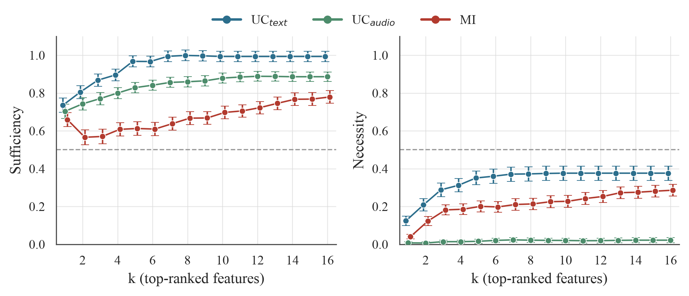
     
    <em>AudioFlamingo3</em>
  

- Audio-only condition

  

    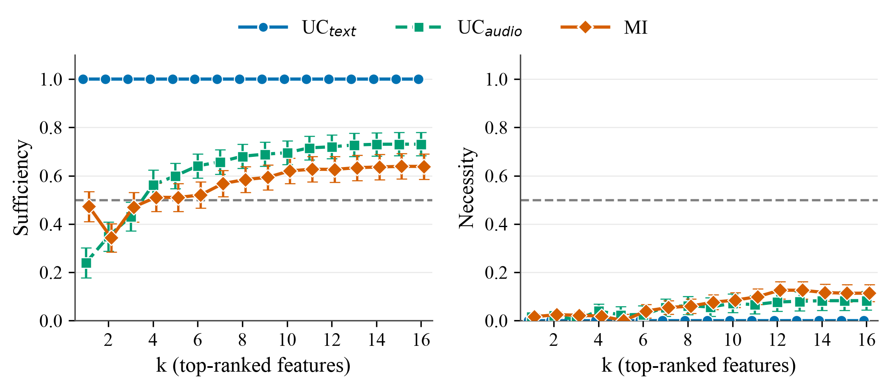
     
    <em>Qwen2.5-Omni</em>
  

  

    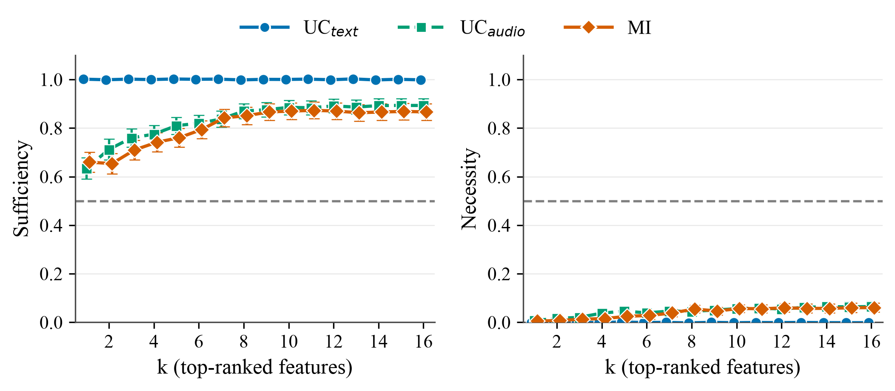
     
    <em>AudioFlamingo3</em>
  

- Text-only condition

  

    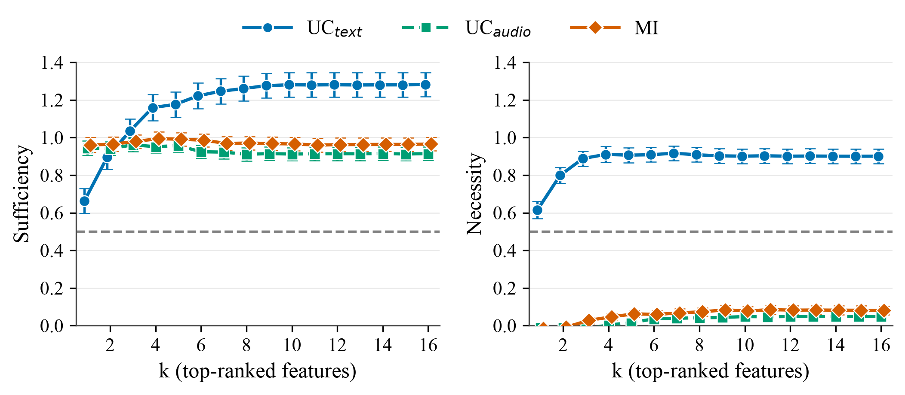
     
    <em>Qwen2.5-Omni</em>
  

  

    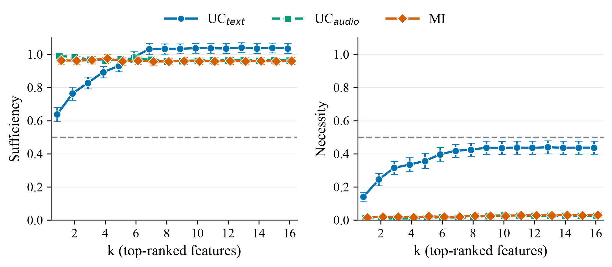
     
    <em>AudioFlamingo3</em>
  

<em>Note: the Qwen2.5-Omni y-axis reaches 1.4 (instead of 1.0) here because UC_text's sufficiency exceeds 1.0 in this condition and would otherwise be clipped.</em>

### Audio Segmentation Example

To verify that the onset-guided segmentation actually produces meaningful, source-specific audio events rather than arbitrary chunks, this section lets you listen to the full segmentation pipeline on one example sample from HumMusQA. The original waveform is first separated into 4 stems (bass, drums, other, vocals) using Demucs; each stem is then split into temporal segments guided by onset detection, giving 4 stems &times; 8 segments = 32 source-segment audio features.

The waveform below each clip shows where in the (silent-padded) audio the segment actually has content. You can see at a glance that each segment lines up with a real, localized event, and you can click directly on the visible waveform to jump there.

  
    <button class="wsplayer-btn" type="button" aria-label="Play">&#9654;</button>
    
  

<em>Original audio (HumMusQA sample).</em>

  

    
Bass

    
      <button class="wsplayer-btn" type="button" aria-label="Play">&#9654;</button>
      
    
  

  

    
Drums

    
      <button class="wsplayer-btn" type="button" aria-label="Play">&#9654;</button>
      
    
  

  

    
Other

    
      <button class="wsplayer-btn" type="button" aria-label="Play">&#9654;</button>
      
    
  

  

    
Vocals

    
      <button class="wsplayer-btn" type="button" aria-label="Play">&#9654;</button>
      
    
  

<em>The four stems separated with Demucs: bass, drums, other, vocals.</em>

  

    
Bass

    

      <button class="wsplayer-btn" type="button" aria-label="Play">&#9654;</button>
      <button class="wsplayer-btn" type="button" aria-label="Play">&#9654;</button>
      <button class="wsplayer-btn" type="button" aria-label="Play">&#9654;</button>
      <button class="wsplayer-btn" type="button" aria-label="Play">&#9654;</button>
      <button class="wsplayer-btn" type="button" aria-label="Play">&#9654;</button>
      <button class="wsplayer-btn" type="button" aria-label="Play">&#9654;</button>
      <button class="wsplayer-btn" type="button" aria-label="Play">&#9654;</button>
      <button class="wsplayer-btn" type="button" aria-label="Play">&#9654;</button>
    

  

  

    
Drums

    

      <button class="wsplayer-btn" type="button" aria-label="Play">&#9654;</button>
      <button class="wsplayer-btn" type="button" aria-label="Play">&#9654;</button>
      <button class="wsplayer-btn" type="button" aria-label="Play">&#9654;</button>
      <button class="wsplayer-btn" type="button" aria-label="Play">&#9654;</button>
      <button class="wsplayer-btn" type="button" aria-label="Play">&#9654;</button>
      <button class="wsplayer-btn" type="button" aria-label="Play">&#9654;</button>
      <button class="wsplayer-btn" type="button" aria-label="Play">&#9654;</button>
      <button class="wsplayer-btn" type="button" aria-label="Play">&#9654;</button>
    

  

  

    
Other

    

      <button class="wsplayer-btn" type="button" aria-label="Play">&#9654;</button>
      <button class="wsplayer-btn" type="button" aria-label="Play">&#9654;</button>
      <button class="wsplayer-btn" type="button" aria-label="Play">&#9654;</button>
      <button class="wsplayer-btn" type="button" aria-label="Play">&#9654;</button>
      <button class="wsplayer-btn" type="button" aria-label="Play">&#9654;</button>
      <button class="wsplayer-btn" type="button" aria-label="Play">&#9654;</button>
      <button class="wsplayer-btn" type="button" aria-label="Play">&#9654;</button>
      <button class="wsplayer-btn" type="button" aria-label="Play">&#9654;</button>
    

  

  

    
Vocals

    

      <button class="wsplayer-btn" type="button" aria-label="Play">&#9654;</button>
      <button class="wsplayer-btn" type="button" aria-label="Play">&#9654;</button>
      <button class="wsplayer-btn" type="button" aria-label="Play">&#9654;</button>
      <button class="wsplayer-btn" type="button" aria-label="Play">&#9654;</button>
      <button class="wsplayer-btn" type="button" aria-label="Play">&#9654;</button>
      <button class="wsplayer-btn" type="button" aria-label="Play">&#9654;</button>
      <button class="wsplayer-btn" type="button" aria-label="Play">&#9654;</button>
      <button class="wsplayer-btn" type="button" aria-label="Play">&#9654;</button>
    

  

<em>The 32 source-segment audio features obtained after onset-guided segmentation (4 stems &times; 8 temporal segments, in chronological order within each stem). Each clip is the full-length reconstruction with only that segment active, so the waveform position shows exactly where the segment sits in time.</em>

